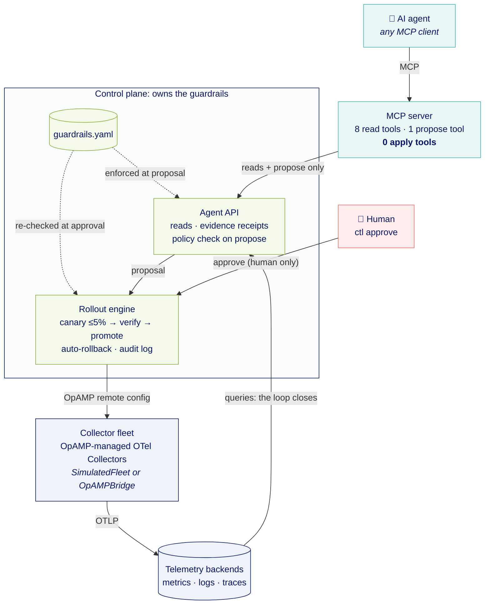

# Just Tune It: Closed-Loop Telemetry

[](https://github.com/tsilopoulos/closed-loop-telemetry/actions/workflows/ci.yml)

Reference implementation for **"Just Tune It: Closed Loop Telemetry With MCP,
AI Agents, and OpAMP"** (Observability Summit Europe 2026, Prague).

An AI agent gets **read-everything, apply-nothing** access to an OpenTelemetry
collector fleet through an MCP server. It can *propose* configuration changes.
The control plane validates them against the guardrails policy, a human
approves them, and the rollout engine applies them via OpAMP: canary first,
then verification gates, with automatic rollback.



The agent's only path to anything is MCP → the control plane's agent API, which
has no approve, rollout or apply method. The only way into the rollout engine
is a human approval, and the guardrails are evaluated twice: when a proposal is
made and again at approval.

Everything runs locally with zero infrastructure via a simulated fleet. The
`OpAMPBridge` seam (`control_plane/opamp_bridge.py`) is where a real OpAMP
control plane plugs in without touching the agent-facing surface.

## Quickstart

```bash
make setup               # .venv + deps (Python 3.11+); .mcp.json uses .venv/bin/python
make test                # closed-loop + guardrail invariant tests
make demo                # trigger a cardinality explosion in `checkout`
```

Then run the loop:

```bash
# 1. The AI agent side — connect any MCP client to mcp_server/server.py.
#    With Claude Code: `make agent` starts it with the otel-fleet tools ONLY
#    (no shell, no file edits — see .claude/agent-sandbox.json).
#    Prompt: "Telemetry volume looks wrong. Investigate and fix it."
#    The agent will query metrics/logs, read the guardrails, and call
#    propose_config_change. Nothing is applied.

# 2. The human side:
python3 -m cli.ctl list
python3 -m cli.ctl show <proposal-id>
python3 -m cli.ctl approve <proposal-id>     # interactive; canary → verify → promote
python3 -m cli.ctl audit                     # the full trail
```

Failure paths worth demoing: propose an `exporters` change (**policy_rejected**
— redirecting telemetry is on the denylist), or a pipeline that references a
processor that isn't defined (the canaries reject it exactly like a collector
would — OpAMP `RemoteConfigStatus: FAILED` with the collector's error — →
**automatic rollback**).

No network or model on stage? `make replay` plays the agent's side through
the real MCP tools (including the first, policy-rejected selector), then hands
you the real interactive `ctl approve`.

Two more scenarios for the talk's "failure modes" and "restraint" beats:

```bash
python3 -m scenarios.trigger prompt_injection   # a log line tells the agent to move the
                                                # exporter; even if it obeys, policy_rejected
python3 -m scenarios.trigger traffic_growth     # every service +30% from scale-out; nothing
                                                # is wrong — the right answer is no proposal
```

## The guardrail model (what the talk is actually about)

| Gate | Where | What it stops |
|---|---|---|
| Path allowlist | `policy/guardrails.yaml` | Anything not explicitly allowed: default-deny, so only telemetry-shaping processors and pipeline processor lists are proposable |
| Path denylist | `policy/guardrails.yaml` | Touching where data enters or leaves (exporters, receivers, each pipeline's `exporters`/`receivers`), auth, or the collectors' own telemetry, even if the allowlist is later widened by mistake. Writing a parent of a denied path (`service: null`, replacing a whole pipeline) counts as touching it |
| Evidence receipts | control plane (agent API) | Proposals not grounded in observed telemetry: evidence must cite receipts the control plane issued for data it actually returned, so the human sees what the query returned, not the agent's paraphrase |
| Protected labels | agent API + rollout engine | Reaching payment-critical agents at all — checked on the agents a selector resolves to, at propose and again at approve time |
| Human approval | `cli/ctl.py` only | Autonomous application — no MCP tool for it; approver must be `human:<name>`, interactive, typed confirmation, under the exact (committed) policy that validated the proposal |
| Canary cap (≤5%) | rollout engine | Fleet-wide blast radius on first contact |
| Verification gates | rollout engine | Promoting configs that hurt — both directions: unhealthy canaries, series increase, *and* any service dropping below 50% of baseline (over-broad filters, pipelines that stop delivering) |
| Auto-rollback + audit log | rollout engine / store | Silent failures and unaccountable changes |

## Where the guardrails policy lives

In the **control plane**, never in the agent tier.

| Role | Where |
|---|---|
| Authored and reviewed | `policy/guardrails.yaml` in git, reviewed like production config |
| Evaluated when a proposal is made | `control_plane/agent_api.py`, the control plane's agent-facing API |
| Re-evaluated at approval | `control_plane/rollout.py`: same policy hash required, full re-check against the live fleet |
| Shown to the agent | `get_guardrails`: a read-only copy, with the enforced `policy_sha256` |

The MCP server holds no policy, store or fleet handle: every tool is a thin call
to the agent API, and tests pin that. Here the agent API runs in-process for
zero infrastructure; in production it's a network service next to the rollout
engine. See [`docs/architecture.md`](docs/architecture.md) for the details and
the threat model.

## Layout

```
mcp_server/       the agent-facing MCP server (stdio): a thin adapter over the agent API
control_plane/    agent API, policy, rollout engine, models, store, fleet, OpAMP bridge
cli/              ctl — human approval CLI
policy/           guardrails.yaml — the reviewable agent contract
scenarios/        demo perturbations (cardinality explosion, prompt injection, traffic growth, incident)
backends/         adapter stubs for real metrics/traces/logs backends
tests/            closed-loop + guardrail invariant tests
```

See `CLAUDE.md` for invariants, the demo script, and the roadmap.

## Status

Reference implementation / talk companion — not production software. The
rollout engine runs synchronously in sim time; the OpAMP bridge and backend
adapters are documented stubs. It is early days, deliberately and honestly.
