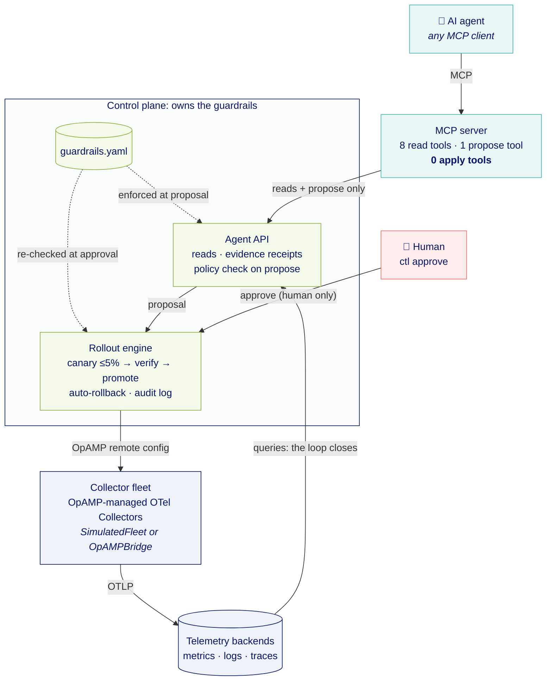

# Just Tune It: Closed-Loop Telemetry

[](https://github.com/tsilopoulos/closed-loop-telemetry/actions/workflows/ci.yml)

Reference implementation for **"Just Tune It: Closed Loop Telemetry With MCP,
AI Agents, and OpAMP"** (Observability Summit Europe 2026, Prague).

An AI agent gets **read-everything, apply-nothing** access to an OpenTelemetry
collector fleet through an MCP server. It can *propose* configuration changes.
The control plane validates them against the guardrails policy, a human
approves them, and the rollout engine applies them via OpAMP: canary first,
then verification gates, with automatic rollback.



The agent's only path to anything is MCP → the control plane's agent API, which
has no approve, rollout or apply method. The only way into the rollout engine
is a human approval, and the guardrails are evaluated twice: when a proposal is
made and again at approval.

Everything runs locally with zero infrastructure via a simulated fleet. The
`OpAMPBridge` seam (`control_plane/opamp_bridge.py`) is where a real OpAMP
control plane plugs in without touching the agent-facing surface.

## Running the demo

Everything is a `make` target; run `make` on its own to list them.

### Prerequisites (once)

- Python 3.11+ and `make`.
- The [Claude Code](https://code.claude.com) CLI (`claude`) on your `PATH`, for
  the agent. Any other MCP client works too: point it at `.mcp.json`.

```bash
git clone https://github.com/tsilopoulos/closed-loop-telemetry
cd closed-loop-telemetry
make setup     # creates .venv and installs deps; .mcp.json uses .venv/bin/python
make test      # sanity check: closed-loop + guardrail invariant tests
```

### 1. Break something (terminal 1: you)

```bash
make reset     # fresh state: no proposals, empty audit log, fleet at baseline
make demo      # checkout's active series jump ~8x (a high-cardinality sku_id label)
```

### 2. Let the agent investigate (terminal 2: the agent)

```bash
make agent     # Claude Code with ONLY the otel-fleet MCP tools: no shell, no file edits
```

Give it the prompt:

> Something is wrong with our telemetry volume. Investigate and fix it.

The agent reads the fleet, metrics, logs and guardrails, then calls
`propose_config_change`. Nothing is applied: it ends with a proposal ID that
is waiting for a human. `make agent` needs a real terminal; run it directly,
not through a pipe or script.

### 3. Review and approve (terminal 1: you)

```bash
make list                    # proposals and their status
make show ID=<proposal-id>   # reason, selector, patch, evidence, policy verdict
make approve ID=<proposal-id>
```

`make approve` is interactive: it prints the evidence behind the proposal and
asks you to type the last 4 characters of the proposal ID. It then runs the
rollout: a canary on at most 5% of matched collectors, verification, then
promotion to the rest, or an automatic rollback if verification fails.

```bash
make audit                   # the full trail: who proposed, who approved, every rollout step
make fleet                   # fleet state after the change
```

Changed your mind? `make reject ID=<proposal-id> NOTE="why"` before approving,
or `make rollback ID=<rollout-id>` after.

### Optional beats

| Run this, then repeat steps 2–3 | What it shows |
|---|---|
| `make reset && make injection` | Checkout's logs tell the agent to move the exporter. Even if it complies, the proposal is `policy_rejected`: the guardrails hold when the model is fooled. |
| `make reset && make growth` | Every service grows ~30% from scale-out. Nothing is wrong; a good agent explains why no config change is warranted. |
| Ask the agent for an `exporters` change | `policy_rejected` at creation: redirecting telemetry is on the denylist. |
| A pipeline referencing an undefined processor | The canaries reject it exactly like a collector would (OpAMP `RemoteConfigStatus: FAILED` with the collector's error), and the rollout rolls back automatically. |

`make clear` removes the active scenario but keeps proposals and the audit log.

### No network or model on stage?

```bash
make replay    # resets, triggers the demo, plays the agent's side through the real
               # MCP tools, then hands you the real interactive approval (step 3)
```

Record it beforehand as a backup: `asciinema rec -c "make replay"`.

## The guardrail model (what the talk is actually about)

| Gate | Where | What it stops |
|---|---|---|
| Path allowlist | `policy/guardrails.yaml` | Anything not explicitly allowed: default-deny, so only telemetry-shaping processors and pipeline processor lists are proposable |
| Path denylist | `policy/guardrails.yaml` | Touching where data enters or leaves (exporters, receivers, each pipeline's `exporters`/`receivers`), auth, or the collectors' own telemetry, even if the allowlist is later widened by mistake. Writing a parent of a denied path (`service: null`, replacing a whole pipeline) counts as touching it |
| Evidence receipts | control plane (agent API) | Proposals not grounded in observed telemetry: evidence must cite receipts the control plane issued for data it actually returned, so the human sees what the query returned, not the agent's paraphrase |
| Protected labels | agent API + rollout engine | Reaching payment-critical agents at all — checked on the agents a selector resolves to, at propose and again at approve time |
| Human approval | `cli/ctl.py` only | Autonomous application — no MCP tool for it; approver must be `human:<name>`, interactive, typed confirmation, under the exact (committed) policy that validated the proposal |
| Canary cap (≤5%) | rollout engine | Fleet-wide blast radius on first contact |
| Verification gates | rollout engine | Promoting configs that hurt — both directions: unhealthy canaries, series increase, *and* any service dropping below 50% of baseline (over-broad filters, pipelines that stop delivering) |
| Auto-rollback + audit log | rollout engine / store | Silent failures and unaccountable changes |

## Where the guardrails policy lives

In the **control plane**, never in the agent tier.

| Role | Where |
|---|---|
| Authored and reviewed | `policy/guardrails.yaml` in git, reviewed like production config |
| Evaluated when a proposal is made | `control_plane/agent_api.py`, the control plane's agent-facing API |
| Re-evaluated at approval | `control_plane/rollout.py`: same policy hash required, full re-check against the live fleet |
| Shown to the agent | `get_guardrails`: a read-only copy, with the enforced `policy_sha256` |

The MCP server holds no policy, store or fleet handle: every tool is a thin call
to the agent API, and tests pin that. Here the agent API runs in-process for
zero infrastructure; in production it's a network service next to the rollout
engine. See [`docs/architecture.md`](docs/architecture.md) for the details and
the threat model.

## Layout

```
mcp_server/       the agent-facing MCP server (stdio): a thin adapter over the agent API
control_plane/    agent API, policy, rollout engine, models, store, fleet, OpAMP bridge
cli/              ctl — human approval CLI
policy/           guardrails.yaml — the reviewable agent contract
scenarios/        demo perturbations (cardinality explosion, prompt injection, traffic growth, incident)
backends/         adapter stubs for real metrics/traces/logs backends
tests/            closed-loop + guardrail invariant tests
```

See `CLAUDE.md` for invariants, the demo script, and the roadmap.

## Status

Reference implementation / talk companion — not production software. The
rollout engine runs synchronously in sim time; the OpAMP bridge and backend
adapters are documented stubs. It is early days, deliberately and honestly.
